# 功能测试文档

以下测试基于项目中的车企场景：

> 测试环境：Ubuntu 18.04.3 LTS、WeBASE管理平台
>
> 角色信息：银行、物流公司、核心车企、轮胎公司、轮毂公司

相关的创建公司以及第三方机构的过程在这里就不展示了。在创建时给汽车公司设定1000万的资产，轮胎公司以及轮毂公司设定0元资产。各个角色创建好后，进行如下测试：

#### 认定车企为核心企业

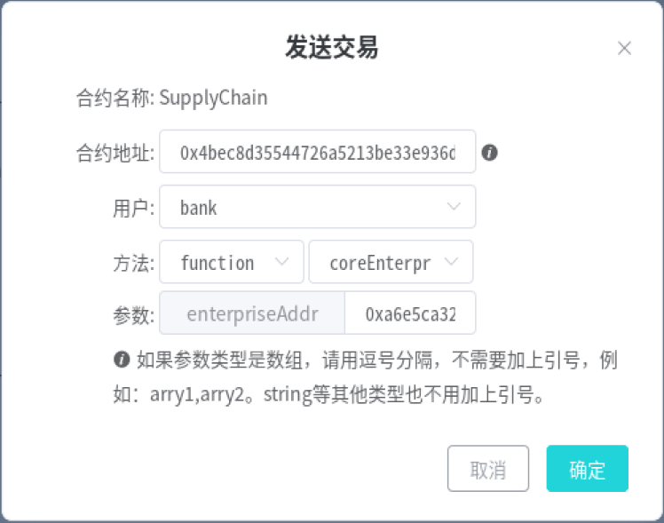

参数为车企的地址。点击确定后，车企会被认证为核心企业，由核心企业签发的应收账款单据可被中下游企业用于融资。（本合约目前的实现是任意第三方均可进行认定）

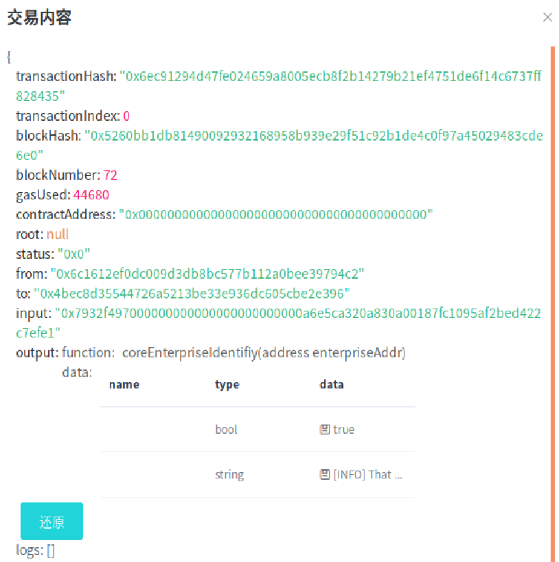

#### 进行交易

##### 车企购买轮胎

车企向从轮胎公司购买轮胎，并签订了 1000 万的应收账款单据，承诺 1 年后归还。

（PS：检查报告时发现在进行这步操作时，参数`info`在测试时填错了，误将一个地址复制了进去，实则是用于记录交易的相关信息，但不影响结果）

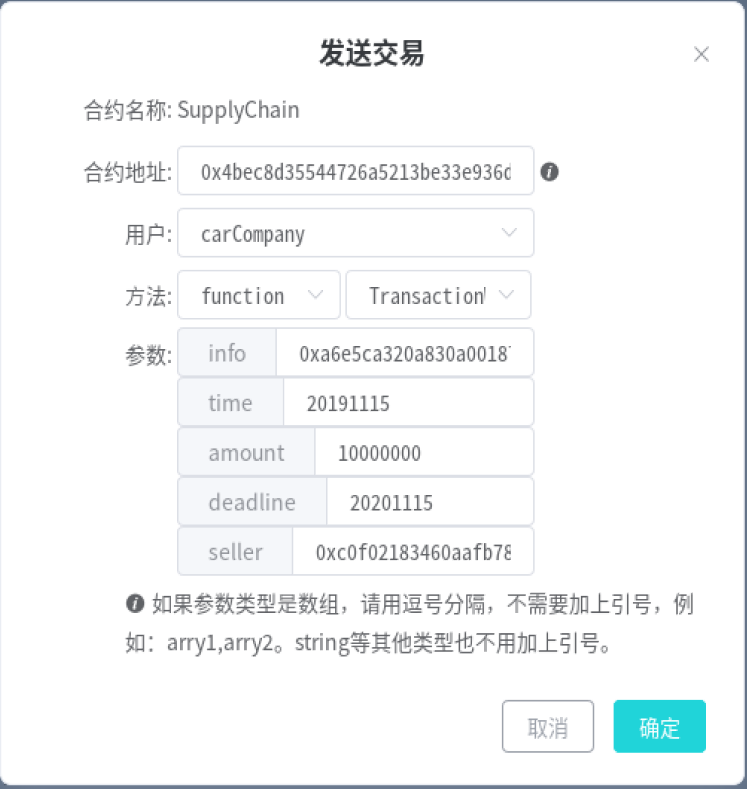

调用`TransactionWithNewReceipt`方法，调用者为车企，`seller`参数即卖方为轮胎公司的地址，设定金额为1000万。点击确定后查看交易的详细信息如下：

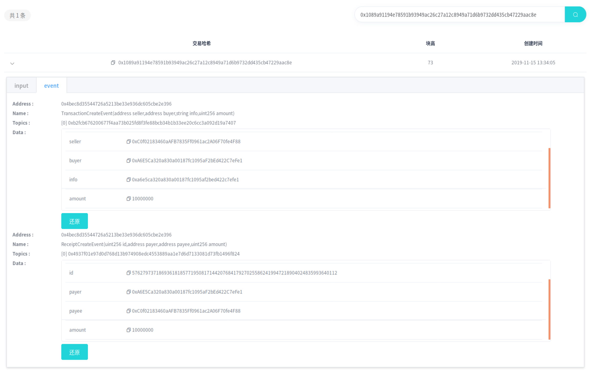

可以看到触发了交易创建和应收账款单据创建两个事件，都记录了相关的信息。这里我们需要记录下这个单据的id：`57627973718693618185771950817144207684179270255862419947218904024835993640112`，在接下来会用到。

##### 查看该单据

通过输入上述id，我们可以查看这个应收账款单据的具体信息：

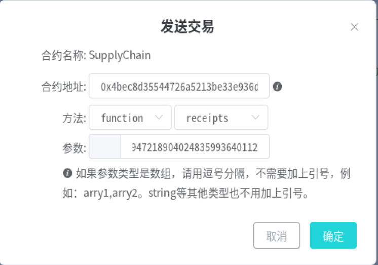

结果如下，我们可以看到这个单据的创建时间、金额、归还时间、可信度、付款方地址以及结算状态。（这里似乎无法显示数组和mapping的相关信息）

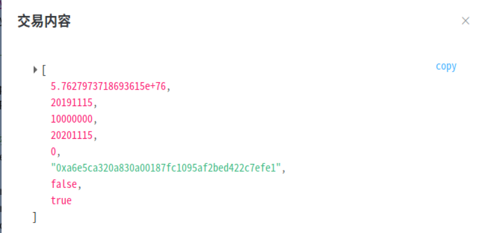

##### 交易认证

银行、物流公司等机构对该应收账款单据进行认证：

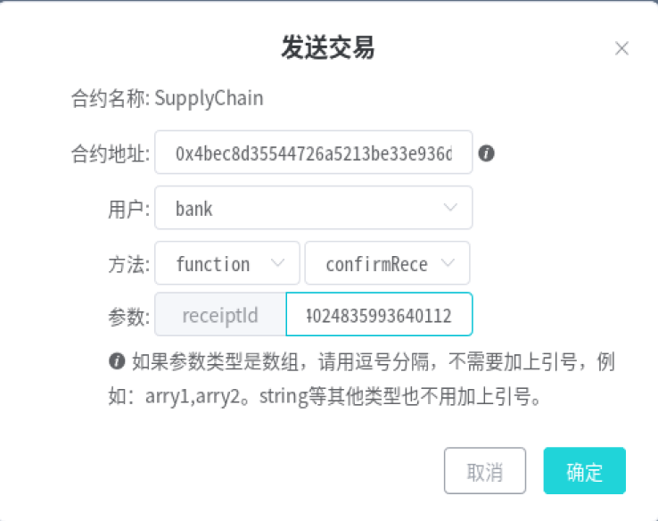

点击确定后，应收账款单据的可信度会上升。银行确认增加2，物流公司确认增加1，当我使用银行和物流公司都对单据进行确认后，在此查看单据，结果如下：

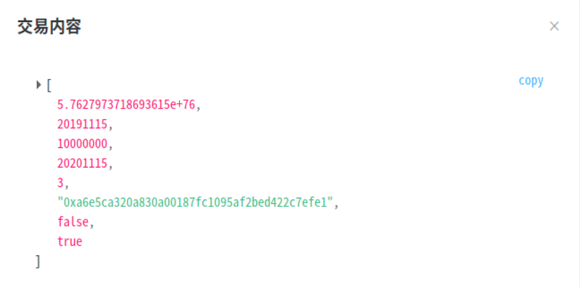

可以看到，可信度变成了3。

##### 轮胎公司向轮毂公司购买轮毂

轮胎公司由于资金短缺向轮毂公司转让了车企的500万的应收账款单据。由于是通过转让应收账款单据进行的交易，我们调用`TransactionByTransferReceipt`函数：

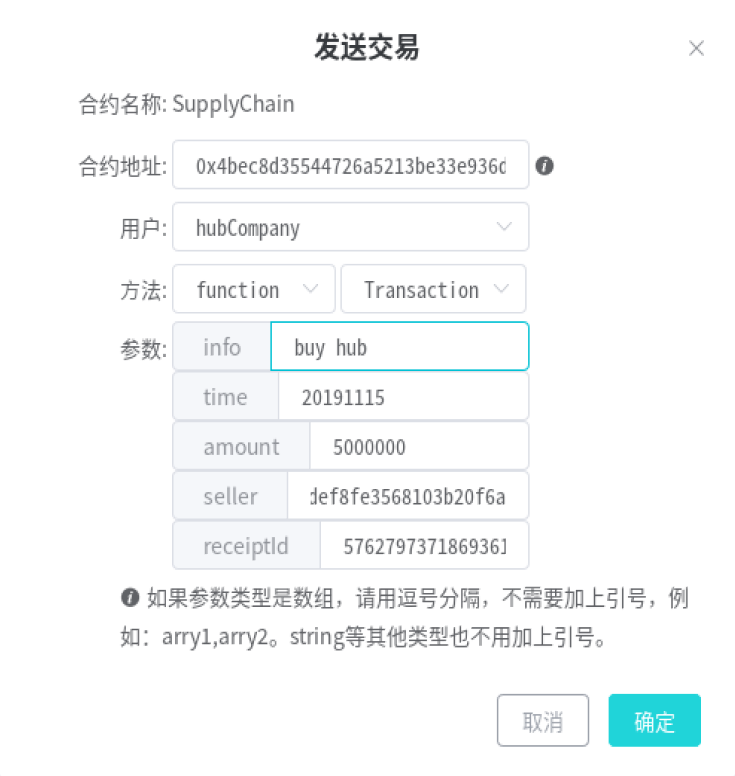

点击确定后，查看交易详情，触发了交易创建和单据转让两个事件：

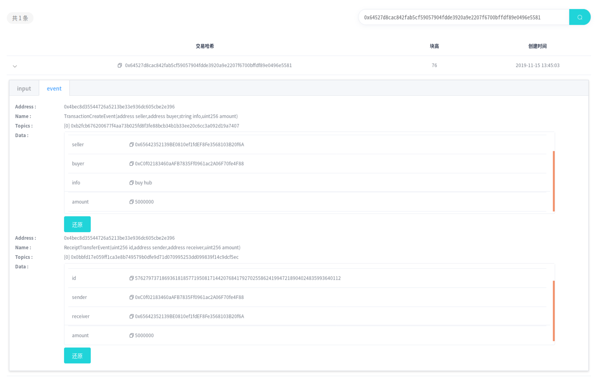

#### 企业融资

经过上述操作，此时轮毂公司已经有了核心车企的应收账款单据了，因此可以利用这个单据向银行请求融资：

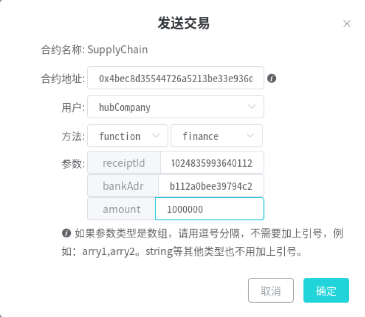

参数输入单据id，银行地址以及金额即可。如果单据不是由核心企业签发、可信度未达要求、或者金额不足，即会失败。此处融资成功，触发如下融资事件：

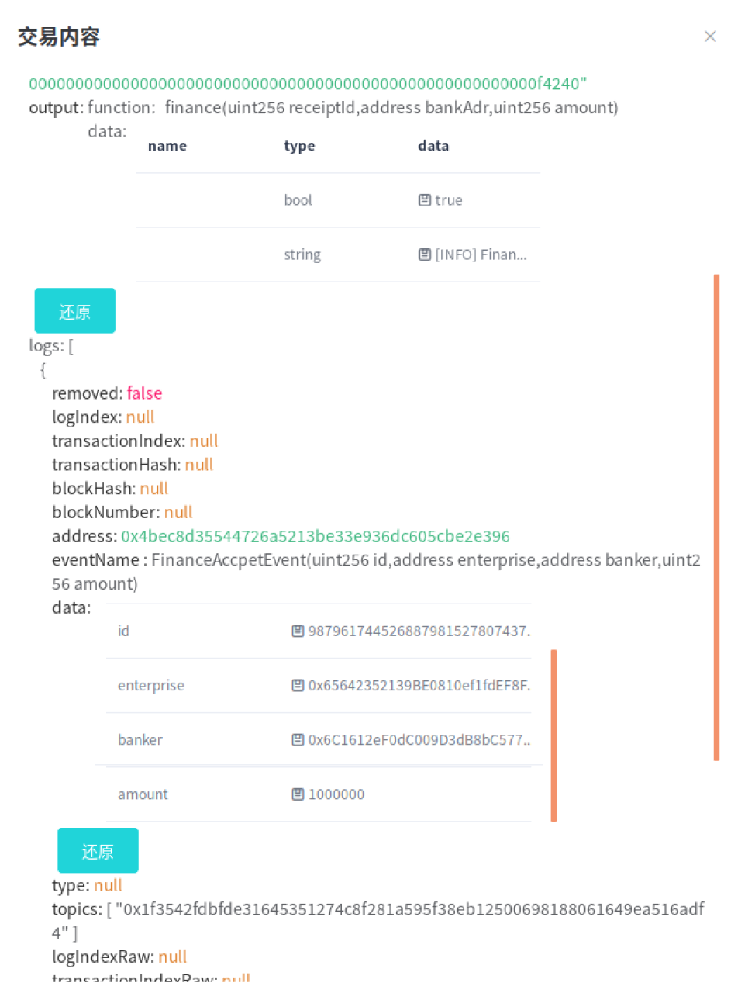

通过融资id查看mapping映射也可以看到融资的相关信息：

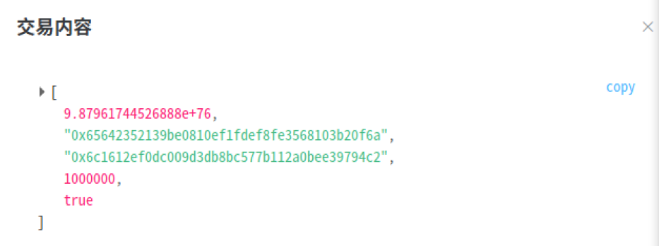

#### 应收账款单据结算

应收账款单据的付款方可以调用`settlement`方法，并输入相应的单据id进行结算，如下：

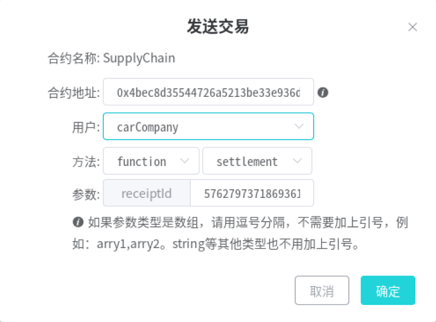

执行上述函数，会对于付款方进行扣款，收款方也会收到相应的钱款，并会触发结算事件。查看该事件，可以看到被结算的单据id，付款人（车企）地址，以及两个收款人（轮胎公司、轮毂公司）的地址。

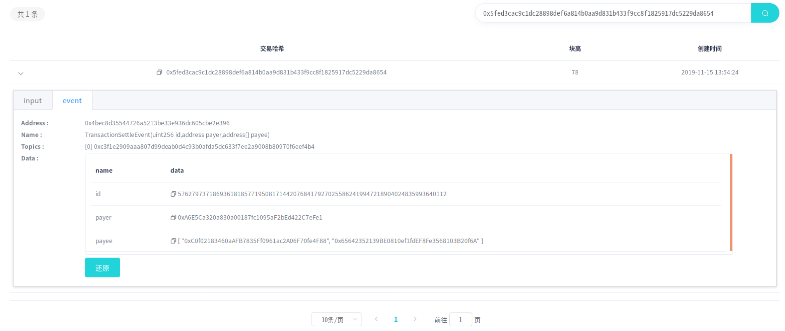

我们也可以通过单据id查看结算详情。

#### 结算结果

##### 车企

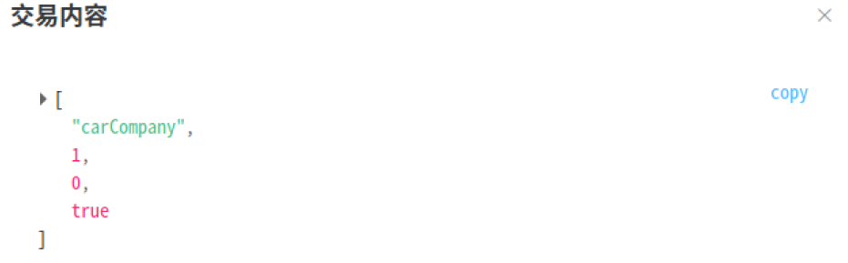

##### 轮胎公司

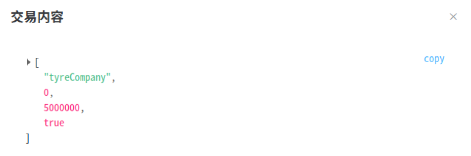

##### 轮毂公司

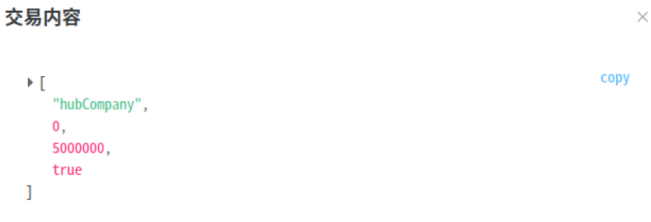

回忆一下，车企原本有资产1000万，而其他两个公司都为0。因此，经过上述操作的执行并结算后，车企的1000万全部用于结算，所以余额为0，轮胎公司本来可以得到1000万，但转让给了轮毂公司500万，所以余额为500万，轮毂公司也为500万。结果正确
