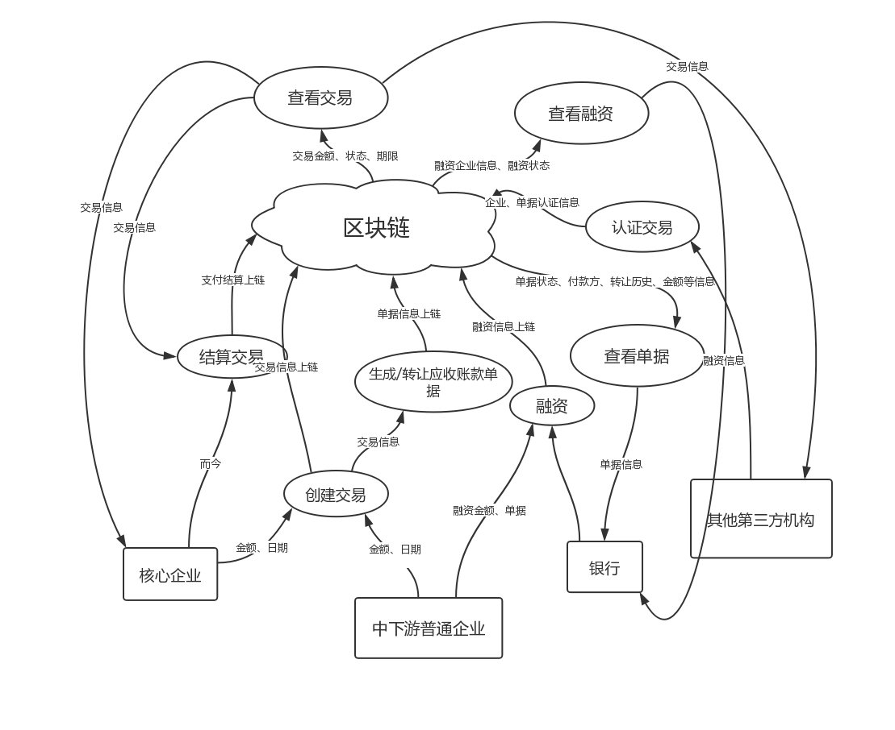
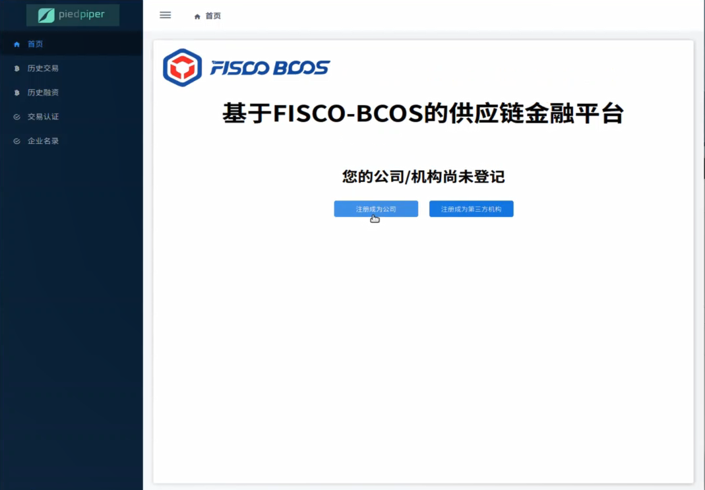
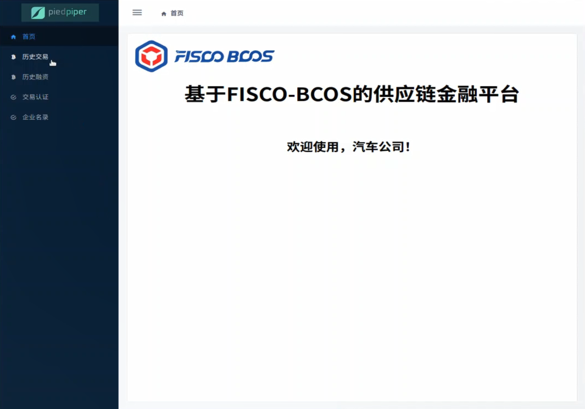
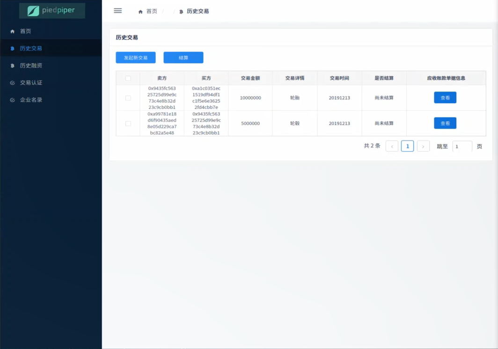
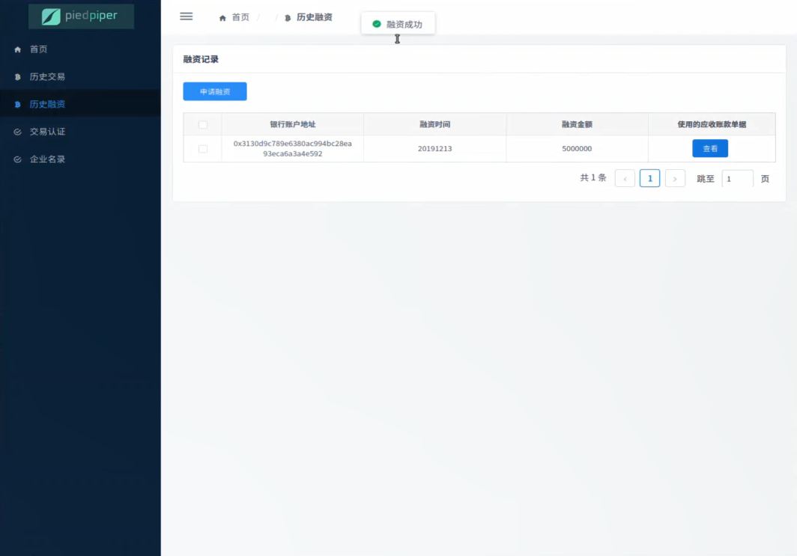
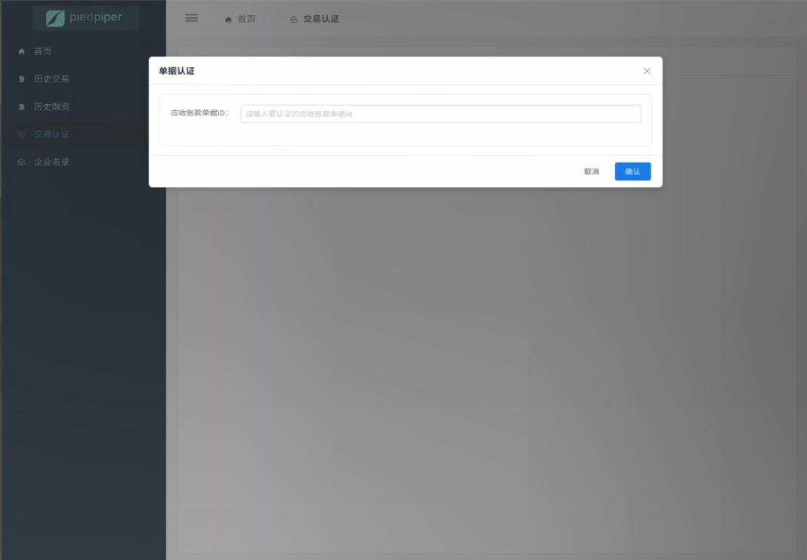
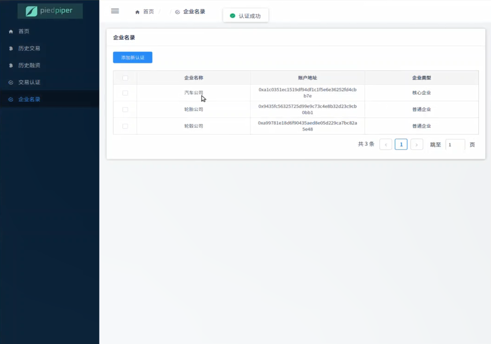

# 中山大学数据科学与计算机学院本科生实验报告

<center><b>（2019年秋季学期）<b></center>
**课程名称：**区块链原理与技术		**任课教师：**郑子彬

|   年级   |    17级     | 专业（方向） |     软件工程     |
| :------: | :---------: | :----------: | :--------------: |
|   学号   |  16340153   |     姓名     |       刘强       |
|   电话   | 15989001328 |    Email     | 3198944008@qq.com |
| 开始日期 |  2019.12.7  |   完成日期   |    2020.01.16    |

## 一、  项目背景

 在传统的供应链金融领域，存在着以下痛点：

+ 严重的交易信息不透明化，需要验证应收单据的真实性
+ 信用无法在整个供应链中传递

这会导致中下游企业融资困难，同时银行等金融机构需要验证交易的有效性和企业的信用水平，费事且费力。

以下是一个具体的例子

> 某车企（宝马）因为其造车技术特别牛，消费者口碑好，所以其在同行业中占据绝对优势地位。因此，在金融机构（银行）对该车企的信用评级将很高，认为他有很大的风险承担的能力。在某次交易中，该车企从轮胎公司购买了一批轮胎，但由于资金暂时短缺向轮胎公司签订了 1000 万的应收账款单据，承诺 1 年后归还轮胎公司 1000 万。这个过程可以拉上金融机构例如银行来对这笔交易作见证，确认这笔交易的真实性。在接下里的几个月里，轮胎公司因为资金短缺需要融资，这个时候它可以凭借跟某车企签订的应收账款单据向金融结构借款，金融机构认可该车企（核心企业）的还款能力，因此愿意借款给轮胎公司。但是，这样的信任关系并不会往下游传递。在某个交易中，轮胎公司从轮毂公司购买了一批轮毂，但由于租金暂时短缺向轮毂公司签订了500万的应收账款单据，承诺1年后归还轮毂公司500万。当轮毂公司想利用这个应收账款单据向金融机构借款融资的时候，金融机构因为不认可轮胎公司的还款能力，需要对轮胎公司进行详细的信用分析以评估其还款能力同时验证应收账款单据的真实性，才能决定是否借款给轮毂公司。这个过程将增加很多经济成本，而这个问题主要是由于该车企的信用无法在整个供应链中传递以及交易信息不透明化所导致的。 

## 二、  方案设计

本项目针对上述痛点问题，结合最新的区块链技术，利用区块链去中心化、难以伪造和篡改的能力，提出了新型的供应链金融模式：

+ 将供应链上的每一笔交易和应收账款单据上链，同时引入第三方可信机构来确认这些信息的交易，例如银行，物流公司等，确保交易和单据的真实性。
+ 同时，支持应收账款的转让，融资，清算等，让核心企业的信用可以传递到供应链的下游企业，减小中小企业的融资难度。 

本项目的智能合约主要实现以下四大功能：

+ 交易上链。记录交易和应收账款单据信息
+ 应收账款的转让上链。小企业可以利用核心企业的单据去融资或者要求核心企业按期归还欠款
+ 融资上链。利用应收账款单据向银行申请融资。
+ 结算上链。到期付清欠款。

### 存储设计

#### Struct结构体

由于本项目中需要保存的内容信息比较少，所以我直接在合约中，通过结构体的方式对于公司、第三方机构、交易、应收账款单据以及融资信息进行管理。以本项目最为重要的应收账款单据结构体为例，其定义如下：

```
// 应收账款单据结构体定义
struct Receipt {
    uint256 id;                         // 单据hash
    uint256[] tranIds;                  // 交易hash,一个单据可被多个交易使用
    uint createTime;                    // 应收账款单据创建时间，和交易创建时间相同
    uint totalAmount;                   // 应收账款总金额
    uint deadline;                      // 结算期限
    uint creditLevel;                   // 单据可信度，由第三方确认后提高
    address payer;                      // 最终付款方
    address[] payees;                   // 收款方, payees[0]为初始交易收款方，其余的为后续账单转让后的收款方
    mapping (address => uint) payInfo;  // 收款方 => 应收金额
    mapping (address => uint) timing;   // 收款方 => 初始创建以及后续转让时间记录
    bool settled;                       // 是否已经结算
    bool exists;                        // 是否存在
}
```

该结构体中，定义了应收账款单据的相关信息，其中，`id`是通过`keccak256`函数产生的，而由于一个单据可能在多个交易中被使用到，所以使用`tranIds`这样一个数组保存与该单据有关的交易`id`，便于以后的查找。

同时，由于单据可以被转让，但付款方都是同一个人，所以我通过`address[] payees`数组记录单据经过一系列转让后可能包含的收款方，因此避免了需要创建很多小单据的情况，同时将收款方集中统一起来也方便管理。此外，在结构体中还包含了两个映射`payInfo`和`timing`，前者用于记录每个收款方对于的应收金额，后者用于记录一些创建和转让的时间点，方便后期的溯源和追踪。

#### mapping映射

mapping可以很好的建立起键值对的映射关系，例如，通过`enterprises`映射，我们可以迅速的通过公司的地址得到记录着该地址对应公司的信息的结构体。其中，`bytes32`对应的是一个`hash`值。

上文中，在结构体中的`exists`字段的作用即是用于判断映射是否存在。与一般的编程语言，我们无法获得mapping里面的值然后与null或空来进行判断该key对应的值是否为空，因此，这里通过使用一个`exists`字段，用来表示改结构体是否已经被赋值。

```
// 数据都设为public使得任何人都可以访问，保证信息的公开透明
mapping (address => Enterprise) public enterprises;             // 公司
mapping (address => ThirdParty) public thirdParties;            // 第三方
mapping (uint256 => Transaction) public transactions;           // 交易
mapping (uint256 => Receipt) public receipts;                   // 单据及其转让记录(转让记录包含在单据结构体中)
mapping (uint256 => Financing) public financings;               // 融资记录
```

#### event事件

事件是以太坊虚拟机(EVM)日志基础设施提供的一个便利接口。当被发送事件（调用）时，会触发参数存储到交易的日志中（一种区块链上的特殊数据结构）。这些日志与合约的地址关联，并记录到区块链中。

同时，对于一个事件，我们可以对其的发生与否进行监听，在之后完整项目的实现中作用会比较大。

本项目中定义的事件如下：

```
// 事件定义
event TransactionCreateEvent(address seller, address buyer, string info, uint amount);
event ReceiptCreateEvent(uint256 id, address payer, address payee, uint amount);
event ReceiptTransferEvent(uint256 id, address sender, address receiver, uint amount);
event FinanceAccpetEvent(uint256 id, address enterprise, address banker, uint amount);
event TransactionSettleEvent(uint256 id, address payer, address[] payee);
```

### 数据流图



### 核心功能

#### 实体的注册

包括公司、第三方机构等实体的注册功能，只是简单的进行赋值，以创建公司为例：

```/
// 企业注册，新注册企业默认类型为普通企业
function newEnterprise(string memory name, uint property) public returns (bool, string memory) {
    if(!enterprises[msg.sender].exists){
        enterprises[msg.sender].name = name;
        enterprises[msg.sender].eType = EnterpriseType.normal;
        enterprises[msg.sender].property = property;
        enterprises[msg.sender].exists = true;
        users.push(msg.sender);
        return (true, "[INFO] Regist an enterprise successfully.");
    }else{
        return (false, "[ERROR] You have registed.");
    }
}
```

#### 核心企业认定

第三方机构可以和区块链上的其他节点达成共识，对于核心企业进行认定：

```/
// 核心企业认定功能
function coreEnterpriseIdentifiy(address enterpriseAddr) public returns (bool, string memory){
    if(!thirdParties[msg.sender].exists){
        return (false, "[ERROR] You don't have right to announce a core enterprise.");
    }else if(!enterprises[enterpriseAddr].exists){
        return (false, "[ERROR] Enterprise doesn't exist.");
    }else{
        enterprises[enterpriseAddr].eType = EnterpriseType.core;
        return (true, "[INFO] That enterprise is core enterprise now.");
    }
}
```

#### 创建交易和应收账款单据

创建交易又分以下两种情况：

+ 创建交易时创建新的应收账款单据
+ 创建交易时转让已有的应收账款单据

上述两种情况分别对应合约中`TransactionWithNewReceipt`和`TransactionByTransferReceipt`两个函数。（合约中的实现都是由买方发起交易）

##### 创建交易时创建新的应收账款单据

对于这种情况，我们直接创建新的交易结构体和应收账款单据结构体，保存该交易的相关信息后上链，并触发相应事件。

```/
// 通过新创建单据的方式发起交易（这里设定由买方发起交易）
function TransactionWithNewReceipt(address seller, uint amount, uint time, uint deadline, string memory info) public returns (bool, string memory) {
    if(!enterprises[msg.sender].exists){
        return (false, "You need regist your company first.");
    }else{
        uint256 transactionId = uint256(keccak256(abi.encodePacked(msg.sender, seller, amount, now)));
        // 创建单据，生成一个单据Id
        uint256 receiptId = uint256(keccak256(abi.encodePacked(seller, amount, now)));
        if(!receipts[receiptId].exists){
            transactions[transactionId] = Transaction(transactionId, seller, msg.sender, amount, info, time, receiptId, false, true);
            enterprises[msg.sender].transactions.push(transactionId);
            enterprises[seller].transactions.push(transactionId);
            // 交易创建事件触发
            emit TransactionCreateEvent(transactionId, seller, msg.sender, info, amount);
            receipts[receiptId].id = receiptId;
            receipts[receiptId].tranIds.push(transactionId);
            receipts[receiptId].createTime = time;
            receipts[receiptId].totalAmount = amount;
            receipts[receiptId].deadline = deadline;
            receipts[receiptId].creditLevel = 0;
            receipts[receiptId].payer = msg.sender;
            receipts[receiptId].payees.push(seller);
            receipts[receiptId].payInfo[seller] = amount;
            receipts[receiptId].timing[seller] = time;
            receipts[receiptId].settled = false;
            receipts[receiptId].exists = true;
            // 应收账款单据创建事件触发
            emit ReceiptCreateEvent(receiptId, msg.sender, seller, amount);
            return (true, "Create a new transaction successfully.");
        }else{
            return (false, "Create receipt failed.");
        }
    }
}
```

##### 创建交易时转让已有的应收账款单据

对于这种情况，`TransactionByTransferReceipt`函数接收将要被转让的应收账款单据，同时判断交易发起者（买方）是否具有转让该单据的权利、单据是否过期（已被结算）、单据金额是否足够等等。然后创建交易，并进行单据的转让：将转让接收者加入应收账款单据中上文提到的`payees`数组，同时将转让者的金额减少、接收者金额增加，触发转让事件。

```/
// 通过转让单据的方式发起交易（这里设定由买方发起交易）
function TransactionByTransferReceipt(address seller,  uint amount, uint time, uint256 receiptId, string memory info) public returns (bool, string memory) {
    if(!enterprises[msg.sender].exists){
        return (false, "You need regist your company first.");
    }else if(!receipts[receiptId].exists){
        return (false, "Receipt doesn't exist.");
    }else if(receipts[receiptId].payInfo[msg.sender] == 0){
        return (false, "Your have no right to transfer this receipt.");
    }else if(receipts[receiptId].settled){
        return (false, "Receipt is out of date.");
    }else if(receipts[receiptId].payInfo[msg.sender] < amount){
        return (false, "Transfer failed, amount limited.");
    }else{
        // 创建交易
        uint256 transactionId = uint256(keccak256(abi.encodePacked(msg.sender, seller, amount, now)));
        Transaction memory tran = Transaction(transactionId, seller, msg.sender, amount, info, time, receiptId, false, true);
        transactions[transactionId] = tran;
        enterprises[msg.sender].transactions.push(transactionId);
        enterprises[seller].transactions.push(transactionId);
        // 交易创建事件触发
        emit TransactionCreateEvent(transactionId, seller, msg.sender, info, amount);
        receipts[receiptId].tranIds.push(transactionId);
        receipts[receiptId].payees.push(seller);
        receipts[receiptId].payInfo[msg.sender] -= amount;
        receipts[receiptId].payInfo[seller] += amount;
        receipts[receiptId].timing[seller] = time;
        emit ReceiptTransferEvent(receiptId, msg.sender, seller, amount);
        return (true, "Transfer successfully.");
    }
}
```

#### 转让单据

转让单据的相关实现包含在`TransactionByTransferReceipt`函数中。

#### 提高单据可信度

在项目背景中，中下游普通企业可以拿着核心企业签发的应收账款单据向银行证明自己的还款能力，并申请融资。而为了验证单据的真实有效性，企业可以请求第三方机构对于单据的有效性进行评估，提高单据的可信度。

单据验证的实现如下，由第三方机构触发：

```/
// 第三方机构对于单据进行确认，以提高可信度。creditLevel, 银行确认+2, 物流公司+1。
function confirmReceipt(uint256 receiptId) public{
    require(
        thirdParties[msg.sender].exists = true,
        "Only thirdParty can comfirm a transaction."
    );
    if(thirdParties[msg.sender].tType == ThirdPartyType.bank){
        receipts[receiptId].creditLevel += 2;
    }else{
        receipts[receiptId].creditLevel += 1;
    }
}
```

#### 企业融资

合约中针对项目背景中下游企业使用核心企业签发的单据进行融资的场景实现如下：

```/
// 下游企业通过核心企业的应收账款单据向银行提出融资申请
// 目前实现:应收账款单据的creditLevel要大于2才能通过融资申请
function finance(uint256 receiptId, address bankAddr, uint amount, uint date) public returns (bool, string memory) {
    if(!enterprises[msg.sender].exists){
        return (false, "[ERROR] You need regist your company first.");
    }else if(!receipts[receiptId].exists){
        return (false, "[ERROR] Receipt doesn't exist.");
    }else if(receipts[receiptId].settled){
        return (false, "[ERROR] Receipt is out of date.");
    }else if(enterprises[receipts[receiptId].payer].eType != EnterpriseType.core){
        // 验证应收账款单据有否是由核心企业签发的
        return (false, "[ERROR] Sorry, the bank refuses your financing request.");
    }else if(receipts[receiptId].creditLevel < 2){
        // 交易可信度需要 >= 3
        return (false, "[ERROR] Sorry, the bank refuses your financing request.");
    }else if(receipts[receiptId].payInfo[msg.sender] < amount){
        // 验证是否有还款能力
        return (false, "[ERROR] Sorry, the bank refuses your financing request.");
    }else{
        // 生成一个融资Id
        uint256 financingId = uint256(keccak256(abi.encodePacked(msg.sender, amount, now)));
        if(!financings[financingId].exists){
            // 融资
            Financing memory finance = Financing(financingId, msg.sender, bankAddr, receiptId, date, amount, true);
            financings[financingId] = finance;

            enterprises[msg.sender].financings.push(financingId);
            emit FinanceAccpetEvent(financingId, msg.sender, bankAddr, amount);
            return (true, "[INFO] Financing successfully.");
        }else{
            return (false, "[ERROR] Financing exists.");
        }
    }
}
```

融资函数在调用时，接收调用者给出的应收账款单据，并判断该单据是否存在以及是否达到了融资的条件：是否由核心企业签发，是否有第三方机构参与认证，单据金额是否足够。如果验证通过，即申请融资成功，并将相关信息上链，否则拒绝。

#### 单据结算

单据结算功能实现签发单据的付款方对于该单据的所有收款方进行结算，并将单据和对应交易都标记为已结算。

```
// 结算
function settlement(uint256 receiptId) public returns (bool, string memory) {
    if(receipts[receiptId].settled){
        return (false, "[ERROR] The receipt already settled.");
    }else if(!receipts[receiptId].exists){
        return (false, "[ERROR] Receipt doesn't exists.");
    }else if(receipts[receiptId].payer != msg.sender){
        return (false, "[ERROR] You don't need to pay anything for this receipt.");
    }else{
        uint totalAmount = 0;
        // 扣款
        for(uint i = 0; i < receipts[receiptId].payees.length; i++){
            address payeeAddr = receipts[receiptId].payees[i];
            uint amount = receipts[receiptId].payInfo[payeeAddr];
            enterprises[payeeAddr].property += amount;
            totalAmount += amount;
        }
        enterprises[receipts[receiptId].payer].property -= totalAmount;
        receipts[receiptId].settled = true;
        for(i = 0; i < receipts[receiptId].tranIds.length; i++){
            transactions[receipts[receiptId].tranIds[i]].settled = true;
        }

        emit TransactionSettleEvent(receiptId, receipts[receiptId].payer, receipts[receiptId].payees);
        return (true, "[INFO] Transaction settles.");
    }
}
```

结算函数在调用时，接收调用者给出的应收账款单据，并判断单据是否存在、是否已经结算、以及调用者是否是该单据的付款方。判断通过后，进行相关的付款和扣款操作：所有收款方收到付款，付款方进行扣款。最后将单据和交易标记为已结算并上链。

### 前后端设计

后端使用Nodejs，前端使用Vue.js框架。

由于官方提供的Nodejs SDK并没有提供指定账户发送交易的api，因此我在实现后端的思路是该后端的服务器是需要每个企业自己运行的。由于在此项目的场景下，后端的实际作用只是起到一个中间媒介的作用：接收前端请求，触发合约，返回数据给前端，并且有关交易、融资等数据都是存储于区块链中，所以每个企业只需要配置到自己的私钥信息后启动自己的服务器连入区块链中即可与其他用户进行交互了。

## 三、  功能测试

合约功能测试部分见同一文件夹下的功能测试文档，该测试在WeBase管理平台下进行。

前后端功能测试可见视频演示，代码部分由于比较多，在此处无法展示，具体可见相关文件。

## 四、  加分项

在前端实现中，我使用了Vue.js框架，并基于iView admin template这一后台管理解决方案进行二次开发，实现了较为可行且对用户友好的系统界面。由于本项目也算的上是用于管理，并且对于交易、融资记录等信息，使用表格是最能清晰直接的展示出来的，所以我认为使用iView admin还是比较合理的。

具体界面见下文，视频的演示见相关文件。

## 五、  界面展示

前端页面基于iView admin template进行二次开发，大体分为五大页面：

+ 首页：欢迎页面，有账户注册功能；
+ 历史交易：以列表的形式展示用户所有历史交易记录，并可以查看交易的单据、发起新交易以及结算交易；
+ 历史融资：以列表的形式展示用户所有历史融资记录，并可以查看融资使用的单据、发起新的融资申请；
+ 交易认证：第三方机构可以在该页面对于单据进行认证；
+ 企业名录：以列表的形式展示所有企业，并可以认证企业为核心企业

以下仅展示静态页面，如需看页面交互见演示视频。

**项目名Pied Piper取自美剧《硅谷》**

#### 首页






#### 历史交易页面



#### 历史融资页面




#### 交易认证页面



#### 企业名录页面



## 六、  心得体会

经过本次大作业的洗礼，个人感觉收获很大，不仅通过自己编写和部署智能合约加深了对于区块链原理及其应用场景的认识，同时前后端双管齐下的设计也让我学到了一些以前没有接触到的知识。在自己编写和调用智能合约后，才感受到区块链作用之大，其不可篡改和防伪造的特点可以解决我们生产生活中的很多痛点问题。

在大作业的过程中也遇到了很多困难，比如说智能合约语言`solidity`的语法，与我之前学习的高级语言相比有很大的限制，再比如官方给出的nodejs sdk的使用，几乎是自己一点点测试出来该怎么使用，但有学习才会成长，在讨论群中的同学也给了我很大的帮助，让我学习到了很多。